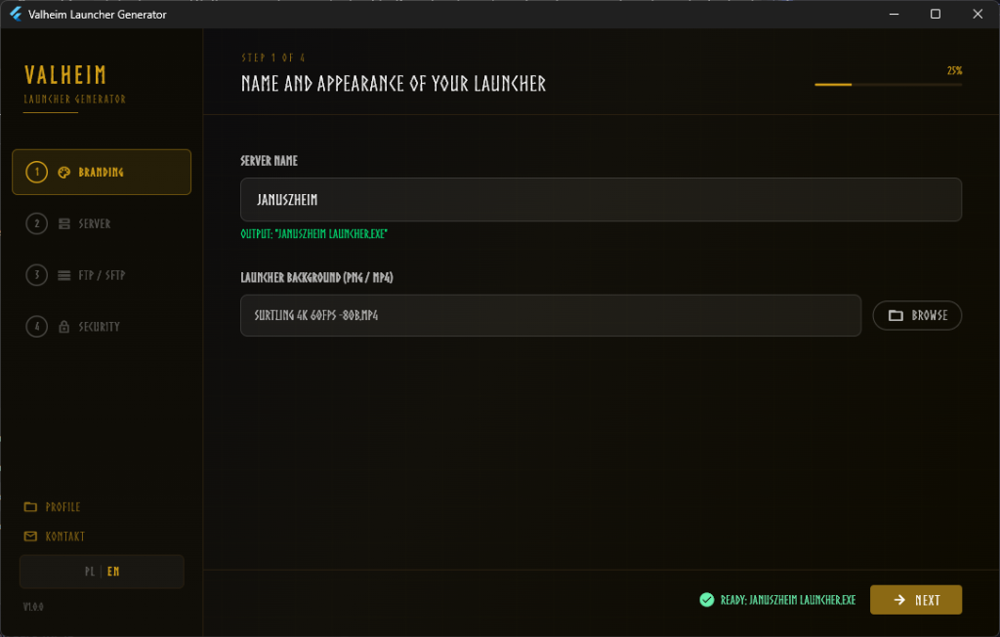
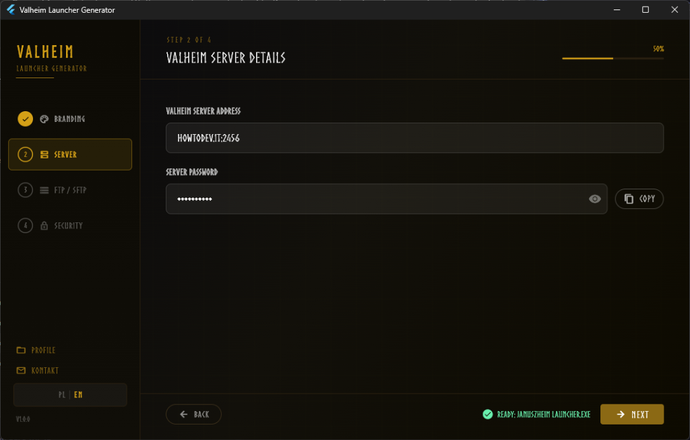
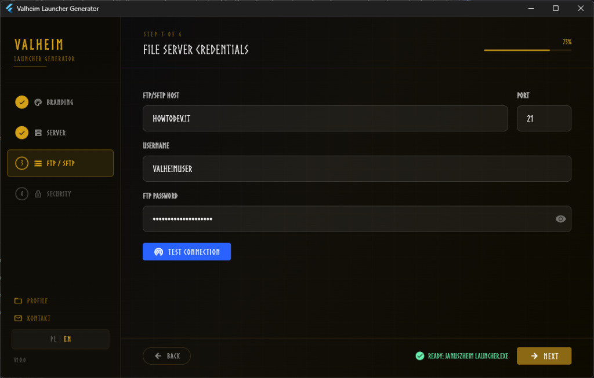
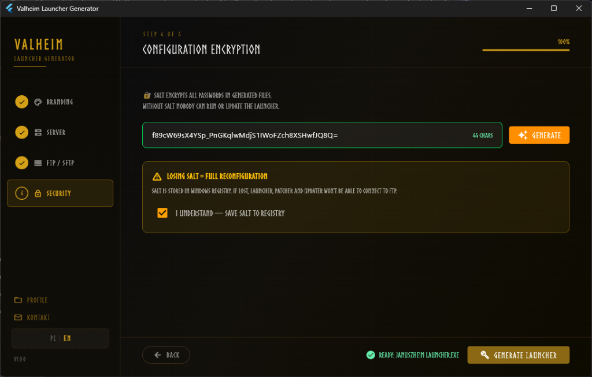

<div align="center">

# ⚔️ Valheim Launcher Generator

[](#-english-version)
[](#-wersja-polska)

</div>

---

<br>

## 🇬🇧 English Version

<div align="center">

**Generate a fully configured, encrypted launcher suite for your private Valheim server — in 4 steps.**

[](https://flutter.dev)
[](https://www.microsoft.com/windows)
[](LICENSE)

</div>

### What is this?

**Valheim Launcher Generator** is a Windows desktop application built with Flutter.  
It's a 4-step wizard that lets any private server admin generate a branded, ready-to-distribute set of **3 standalone executables** — configured and encrypted specifically for their server.

No coding required. Fill in the form, click **Generate**, get 3 `.exe` files.

### Generated Suite

| App | Purpose |
|---|---|
| `{ServerName} Launcher.exe` | Players launch Valheim with one click — auto-connects to your server |
| `{ServerName} Patcher.exe` | Admin tool — uploads mod packages to FTP (BepInEx) |
| `{ServerName} Updater.exe` | Checks for launcher updates and downloads them from FTP |

All three are standalone, portable Windows executables. No installation needed.

### 🖼️ Wizard Steps — Screenshots

#### Step 1 — Branding
> Set your server name and select a background video/image for the launcher.



#### Step 2 — Server Details
> Enter the Valheim game server address (IP:port) and the server password.



#### Step 3 — File Server Credentials
> Configure your FTP/SFTP host, port, username and password. Use **Test Connection** to verify.



#### Step 4 — Configuration Encryption
> Generate a unique encryption salt that protects all credentials in the generated executables. The salt is stored in Windows Registry — **losing it means a full reconfiguration.**



### Key Features

- 🔐 **Encrypted credentials** — FTP passwords and server data are XOR-encrypted with SHA-256, never stored as plaintext
- 🎬 **Video background** — Launcher supports animated `.mp4` background per server branding
- 🌍 **Multilingual** — Polish / English (i18n via ARB)
- 📦 **Portable executables** — Each app runs standalone, no runtime required
- 🔄 **Auto-update** — Updater checks FTP version file and downloads newer launcher automatically
- 🧩 **BepInEx mod sync** — Patcher scans FTP, computes checksums, syncs mods to local Valheim
- 🔌 **FTP + SFTP** — Auto-detects which protocol the server supports
- 🎨 **Dynamic icons** — Pixel-art icons generated automatically from server name acronyms

### Architecture

```
vaheim_launcher_generator/
├── lib/
│   ├── generator/           # 4-step wizard UI + state
│   ├── modules/
│   │   ├── launcher_module/ # → Launcher.exe
│   │   ├── patcher_module/  # → Patcher.exe
│   │   └── updater_module/  # → Updater.exe
│   ├── utils/
│   │   └── crypto_service.dart   # HMAC-SHA256 XOR encrypt/decrypt
│   └── build_service.dart        # Build pipeline orchestrator
└── test/
    └── crypto_service_test.dart  # 10 unit tests ✅
```

### Getting Started

```powershell
git clone https://github.com/PawelSzymanski89/valheim_launcher_generator.git
cd valheim_launcher_generator
flutter pub get
flutter run -d windows
```

### ⚠️ Disclaimer & Hobby Project Notice

> **This is a hobby project.** Use it at your own risk and with caution.
>
> - The author **is not responsible** for any data leaks, server damage, data loss, or any other issues that may arise from using this software.
> - **Always create regular backups** of your server before using the launcher, patcher, or updater.
> - The application has been secured to the best of the author's knowledge and abilities, but no software is 100% secure.
> - The author is **open to suggestions** and improvements — feel free to open an issue or submit a pull request.

### ⚖️ Legal Notice

> **Valheim®** is a registered trademark of **Iron Gate AB**.  
> This application is an independent, unofficial tool and uses the name "Valheim" solely for the purpose of identifying compatibility.  
> We do not claim any rights to the Valheim brand or logo.

### 🚫 Attribution — Required

> **Removing the author's name, credits, or the link to this generator from any fork or derivative work is strictly prohibited.**
>
> Every generated launcher contains a footer credit:  
> *Designed with ❤️ by [cygan](https://www.linkedin.com/in/pszym89/)*
>
> This attribution **must remain intact** in all forks, copies, and derivative works.  
> Every generated launcher also includes information that it was created using:  
> **[Valheim Launcher Generator](https://github.com/PawelSzymanski89/valheim_launcher_generator)**

### Commercial & Custom Orders

Need a custom-branded launcher suite for your server or community?

📧 **pawel@howtodev.it**  
🐙 **[github.com/PawelSzymanski89](https://github.com/PawelSzymanski89)**

---

<br>

## 🇵🇱 Wersja Polska

<div align="center">

**Stwórz własny, zaszyfrowany zestaw aplikacji dla swojego prywatnego serwera Valheim — w 4 krokach.**

[](https://flutter.dev)
[](https://www.microsoft.com/windows)
[](LICENSE)

</div>

### Co to jest?

**Valheim Launcher Generator** to desktopowa aplikacja Windows zbudowana we Flutterze.  
Działa jako kreator (wizard) w 4 krokach, który pozwala administratorowi prywatnego serwera Valheim wygenerować gotowy, markowy zestaw **3 samodzielnych plików `.exe`** — skonfigurowanych i zaszyfrowanych pod jego konkretny serwer.

Bez programowania. Wypełnij formularz, kliknij **Generuj**, odbierz 3 pliki `.exe`.

### Generowane aplikacje

| Aplikacja | Przeznaczenie |
|---|---|
| `{NazwaSerwera} Launcher.exe` | Gracze uruchamiają Valheim jednym kliknięciem — automatyczne połączenie z serwerem |
| `{NazwaSerwera} Patcher.exe` | Narzędzie admina — wysyłanie paczek modów na FTP (BepInEx) |
| `{NazwaSerwera} Updater.exe` | Sprawdza dostępność nowej wersji launchera i pobiera ją automatycznie |

Wszystkie trzy są przenośnymi plikami `.exe` — nie wymagają instalacji.

### 🖼️ Kroki kreatora — Zrzuty ekranu

#### Krok 1 — Branding
> Ustaw nazwę swojego serwera i wybierz tło (wideo lub obraz) dla launchera.


#### Krok 2 — Dane serwera
> Wprowadź adres serwera gry Valheim (IP:port) oraz hasło serwera.


#### Krok 3 — Dane serwera plików
> Skonfiguruj host FTP/SFTP, port, nazwę użytkownika i hasło. Użyj **Test Connection** aby zweryfikować połączenie.


#### Krok 4 — Szyfrowanie konfiguracji
> Wygeneruj unikalne ziarno szyfrujące (salt), które zabezpiecza wszystkie dane uwierzytelniające w generowanych plikach wykonywalnych. Salt jest zapisywany w Rejestrze Windows — **jego utrata oznacza pełną rekonfigurację.**


### Kluczowe funkcje

- 🔐 **Szyfrowanie** — hasła FTP i dane serwera zaszyfrowane XOR+SHA-256, brak plaintextu w binarce
- 🎬 **Wideo w tle** — launcher obsługuje animowane tło `.mp4`, personalizowane dla każdego serwera
- 🌍 **Wielojęzyczność** — Polski / Angielski (i18n via ARB)
- 📦 **Przenośne exe** — każda aplikacja działa samodzielnie bez instalacji
- 🔄 **Auto-aktualizacja** — updater sprawdza plik wersji na FTP i pobiera nowszą wersję launchera
- 🧩 **Synchronizacja modów BepInEx** — patcher skanuje FTP, liczy sumy kontrolne, synchronizuje mody
- 🔌 **FTP + SFTP** — automatyczne wykrycie protokołu serwera
- 🎨 **Dynamiczne ikony** — pixel-artowe ikony generowane automatycznie z akronimów nazwy serwera

### Architektura

```
vaheim_launcher_generator/
├── lib/
│   ├── generator/           # Wizard 4-krokowy + zarządzanie stanem
│   ├── modules/
│   │   ├── launcher_module/ # → Launcher.exe
│   │   ├── patcher_module/  # → Patcher.exe
│   │   └── updater_module/  # → Updater.exe
│   ├── utils/
│   │   └── crypto_service.dart   # Szyfrowanie HMAC-SHA256 XOR
│   └── build_service.dart        # Orkiestrator budowania
└── test/
    └── crypto_service_test.dart  # 10 testów jednostkowych ✅
```

### Uruchomienie

```powershell
git clone https://github.com/PawelSzymanski89/valheim_launcher_generator.git
cd valheim_launcher_generator
flutter pub get
flutter run -d windows
```

### ⚠️ Zastrzeżenie — Projekt hobbystyczny

> **To jest projekt hobbystyczny.** Używaj go z rozwagą i na własne ryzyko.
>
> - Autor **nie ponosi odpowiedzialności** za wyciek danych, uszkodzenie serwera, utratę danych ani żadne inne problemy wynikające z użytkowania tego oprogramowania.
> - **Zawsze twórz regularne kopie zapasowe** swojego serwera przed użyciem launchera, patchera lub updatera.
> - Aplikacja została zabezpieczona zgodnie z najlepszą wiedzą i umiejętnościami autora, ale żadne oprogramowanie nie jest w 100% bezpieczne.
> - Autor jest **otwarty na sugestie** i ulepszenia — zachęcamy do zgłaszania Issue lub Pull Requestów.

### ⚖️ Nota prawna

> **Valheim®** jest zarejestrowanym znakiem towarowym **Iron Gate AB**.  
> Niniejsza aplikacja jest niezależnym, nieoficjalnym narzędziem i używa nazwy „Valheim" wyłącznie w celu identyfikacji kompatybilności.  
> Nie rościmy sobie żadnych praw do marki ani logo Valheim.

### 🚫 Atrybucja — Wymagana

> **Usuwanie imienia autora, informacji o twórcy lub odnośnika do niniejszego generatora z jakiegokolwiek forka lub pracy pochodnej jest surowo zabronione.**
>
> Każdy wygenerowany launcher zawiera stopkę:  
> *Designed with ❤️ by [cygan](https://www.linkedin.com/in/pszym89/)*
>
> Ta atrybucja **musi pozostać nienaruszona** we wszystkich forkach, kopiach i pracach pochodnych.  
> Każdy wygenerowany launcher zawiera również informację, że został utworzony za pomocą:  
> **[Valheim Launcher Generator](https://github.com/PawelSzymanski89/valheim_launcher_generator)**

### Kontakt komercyjny

Potrzebujesz dedykowanego launchera dla swojego serwera lub społeczności?

📧 **pawel@howtodev.it**  
🐙 **[github.com/PawelSzymanski89](https://github.com/PawelSzymanski89)**

---

*MIT © 2024–2026 Paweł Szymański*
